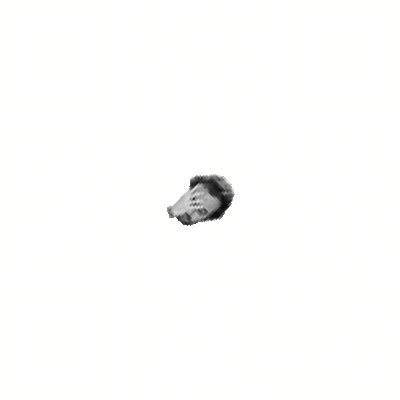
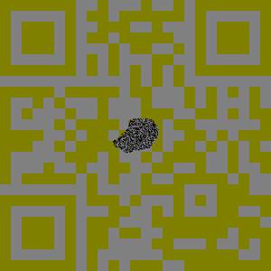
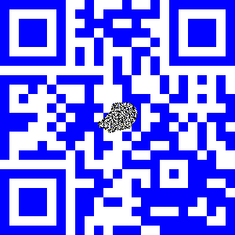

# Image Trickery 
**Category: Forensics**
**Points: 30**

### Challenge
> What do Twitch emotes have to do with a CTF? No idea, but there's a flag in [here](https://angstromctf.com/static/forensics/image_trickery/mystery.png) somewhere. *kappa*

### Hint
> The colours in this image are just stunning.

### Solution

Seems like steganography. So let's try [this Javascript tool](http://incoherency.co.uk/image-steganography/#unhide).

We get this as the result.

There's a QR code! So we need to enhance the contrast and change the hue until it is scannable

After scanning the QR code, we get [this pastebin link](https://pastebin.com/S9De6WYA). *(See `pastebin-base64.txt`)*

The text is base-64 encoded, let's decode it. *(See `pastebin-decoded.txt`)*

Notice now the text starts with `data:image/svg+xml`, it is a SVG URI.
According to [this](https://css-tricks.com/probably-dont-base64-svg/), we need to wrap it in`` to view in a web-browser. 

*(Open `pastebin-base64.html`)*

Finally, we have the flag in the image: `actf{fa1L_F15H}`